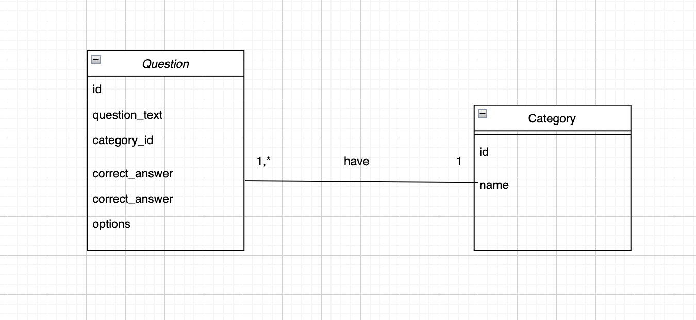

# Quiz Application

In this repository, I created the same quiz application in both PHP and Golang to highlight the differences between the two languages.
Both applications use the same MySQL database, and everything runs in Docker.

---

## Features

- **Topic Selection**: Users can choose their preferred quiz topics(category).
- **Database Integration**: All quiz data is stored and retrieved from a MySQL database.
- **Dockerized Setup**: Both versions of the application and the database run in a Dockerized environment.
- **Cross-Language Integration**: Both PHP/Laravel and Go projects use the same MySQL db.

---

## Technologies Used

- **Programming Language**: Golang & PHP
- **Database**: MySQL
- **Containerization**: Docker
- **Frontend/Backend**: For the frontend in Laravel, we used Blade as the template engine, while in Go, we use the template package.

---

## Requirements

- Docker

---

## Setup Instructions

### Clone the Repository

```bash
git clone https://github.com/L-Wiem/quiz-app.git
```

### Configure Environment Variables

The `.env` file in the laravel project is tracked just to make it easier to clone and run the project without further setup.
The file contains some configuration like the database access credentials.

### Build and Run with Docker

Build and start the project, run the command

```bash
docker-compose up --build
```

### Check the Quiz applications

Once the containers are running you can visit:
- http://localhost:8181/ : The Go version
- http://localhost:8000/ : The PHP/Laravel version

### Access the application container

If you need to access the containers, for example to check the logs, you can use the below command

```bash
docker exec -it laravel sh
```

### Access the Database

To inspect or modify the database, access the MySQL container via the command:

```bash
docker exec -it database mysql -u root -p
```

Enter your password and use the `shared_db` database:

```sql
USE shared_db;
SHOW TABLES;
```

---

## Project Structure

```
quiz-app/
├── golang/
├──── main.go
├──── go.mod
├──── go.sum
├──── Dockerfile             
├── laravel/
├──── Dockerfile   
├── docker-compose.yml     
└── README.md            
```
## Modeling
### Class Diagram


### Sequence Diagram

## Tests

Unit, integration, and end-to-end tests for the golang code can be found in the ```golang``` folder.
Tests for PHP/Laravel are inside the folder  ```laravel/tests```.

While I didn't aim for 100% code coverage, I focused on covering the main logic.

---

## Future Enhancements
- Add difficulty levels.
- Expand the questions with more topics.
- Add a timer.
- Add analytics for tracking user performance.
